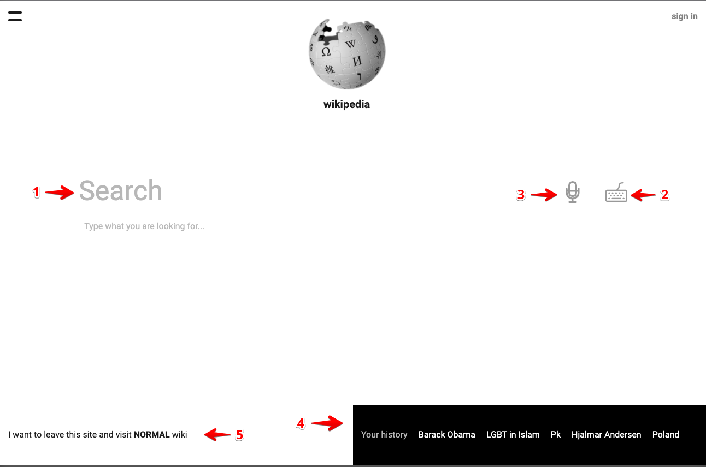
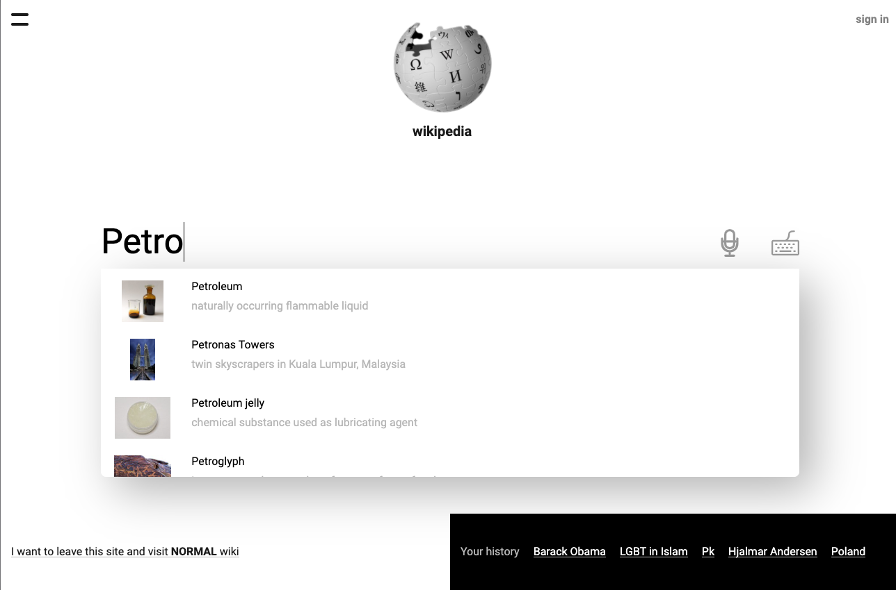
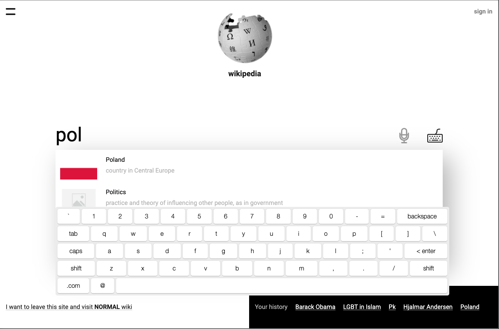
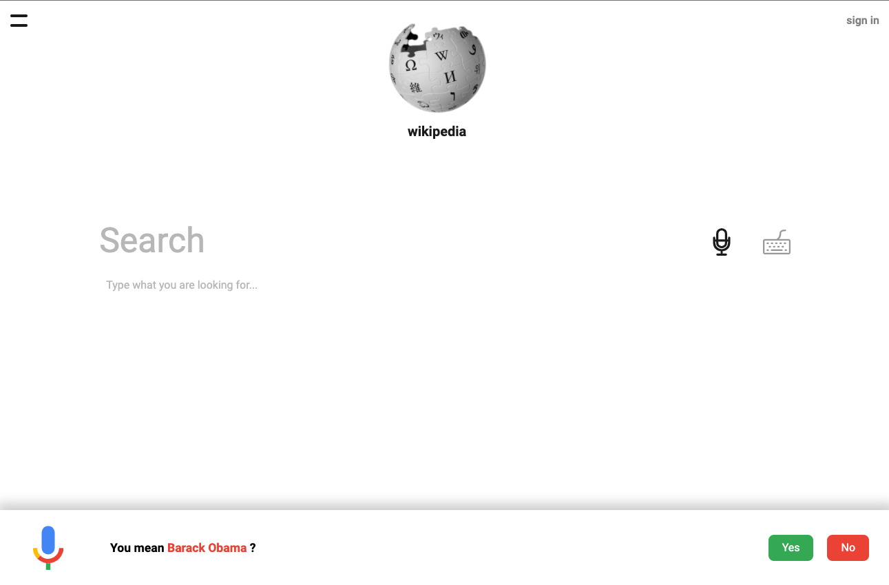

#Wikipedia


> Completely new wikipedia, 
> which you have not seen yet

##Key technologies

- Typescript
- React and related libraries (Redux, Redux-Saga)
- 'wtf_wikipedia' as wikitext parser https://github.com/spencermountain/wtf_wikipedia

##Usage
You can check live example https://wiki-app-test.herokuapp.com, or you can run clone this repo, install packages, and run this app locally:
```sh
$ yarn install && yarn start
```

`Use google chrome to get full user experience`

##Main Page


1. Search input, in which you can type your request and find articles
2. Virtual keyboard button, which helps you to enter text, if you have issues with your physical keyboard 
3. Voice input button, you can search articles by voice 
4. Your history section (Visited links)
5. Link to original wikipedia

##Article Page


Article with title, images sections, sub-sections, deep-section, related categories block, sidebar.
You can click on image to handle gallery mode.


  
